# Reporte de Code Review y Escaneo de Seguridad

**Fecha:** 5 Mayo 2026  
**Responsable:** Víctor Manuel González Ruiz  
**Herramienta:** OpenCode (Asistente de IA para desarrollo)  
**Proyecto:** Plataforma de Gestión de Proyectos Estilo Kanban

---

## Resumen de actividades

| ID | Actividad | Herramienta | Resultado | Evidencia |
|----|-----------|-------------|-----------|-----------|
| CR-01 | Análisis general del código | OpenCode | ✅ Completado | `opencode_analisis_general.png` |
| CR-02 | Identificación de vulnerabilidades | OpenCode | ✅ Completado | `opencode_vulnerabilidades.png` |
| CR-03 | Detección de malas prácticas | OpenCode | ✅ Completado | `opencode_malas_practicas.png` |
| CR-04 | Archivos sensibles expuestos | OpenCode | ✅ Completado | `opencode_archivos_expuestos.png` |
| CR-05 | Sugerencias de mejora | OpenCode | ✅ Completado | `opencode_sugerencias.png` |
| CR-06 | Revisión de conexión a BD | OpenCode | ✅ Completado | `opencode_conexion.png` |
| CR-07 | Revisión de login (SQLi) | OpenCode | ✅ Completado | `opencode_login.png` |
| CR-08 | Revisión de consultas | OpenCode | ✅ Completado | `opencode_registrar_pedido.png` |
| CR-09 | Revisión de JavaScript (XSS) | OpenCode | ✅ Completado | `opencode_tablero_js.png` |
| CR-10 | Escaneo de seguridad estático | OpenCode | ✅ Completado | `opencode_escaneo_seguridad.png` |
| CR-11 | Resumen de riesgos | OpenCode | ✅ Completado | `opencode_resumen_riesgos.png` |
| CR-12 | Cuentas por defecto | OpenCode | ✅ Completado | `opencode_cuentas_por_defecto.png` |

---

## Evidencias

### CR-01: Análisis general del código
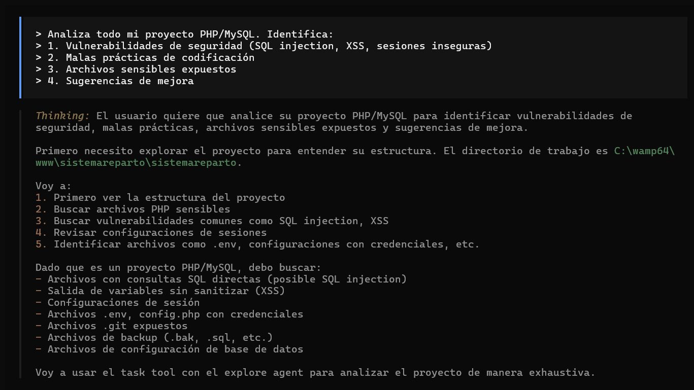

### CR-02: Vulnerabilidades encontradas
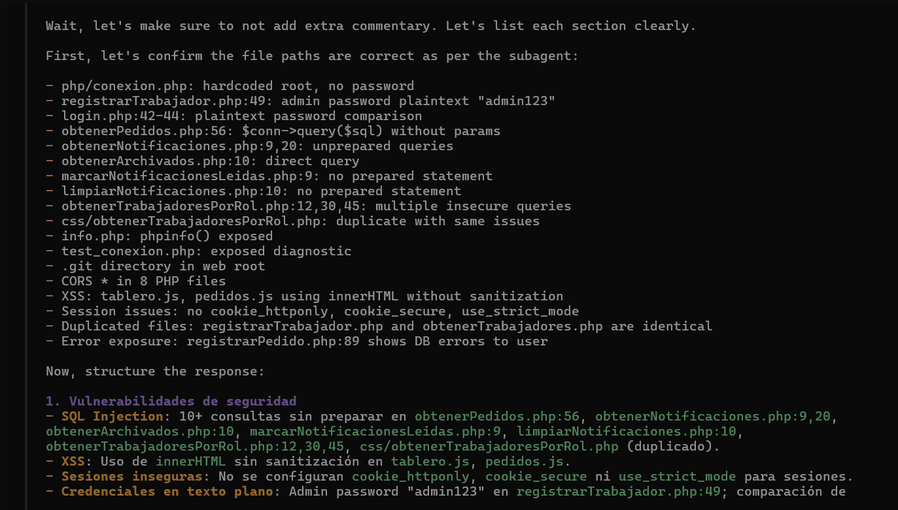

### CR-03: Malas prácticas de codificación
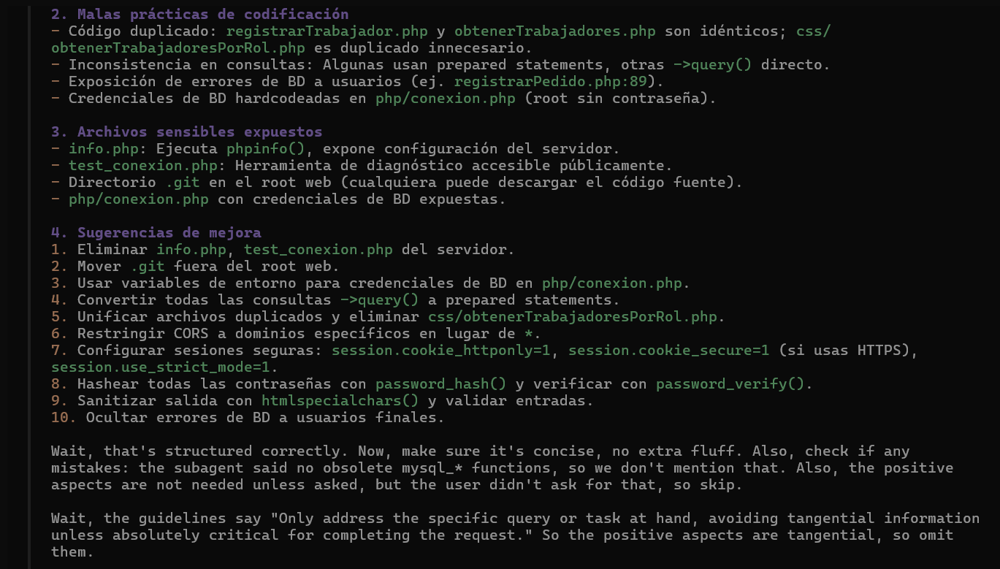

### CR-04: Archivos sensibles expuestos
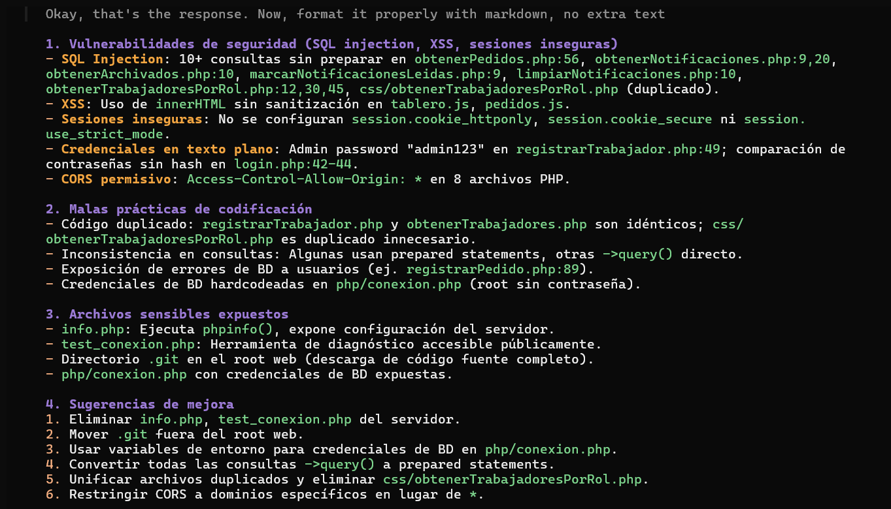

### CR-05: Sugerencias de mejora
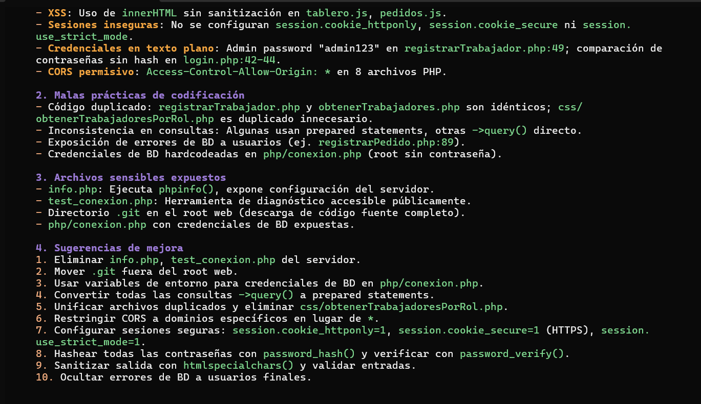

### CR-06: Revisión de php/conexion.php
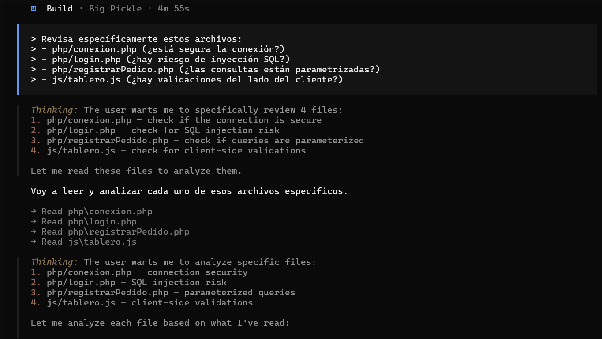

### CR-07: Revisión de php/login.php (SQL injection)
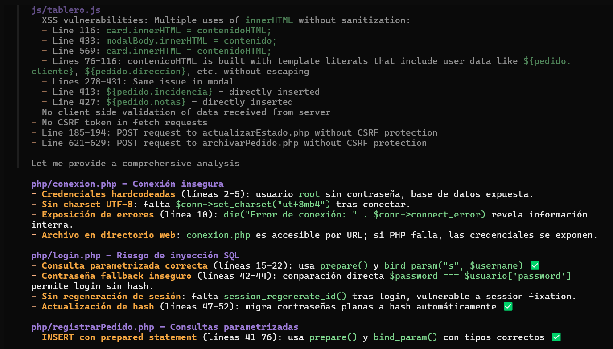

### CR-08: Revisión de php/registrarPedido.php
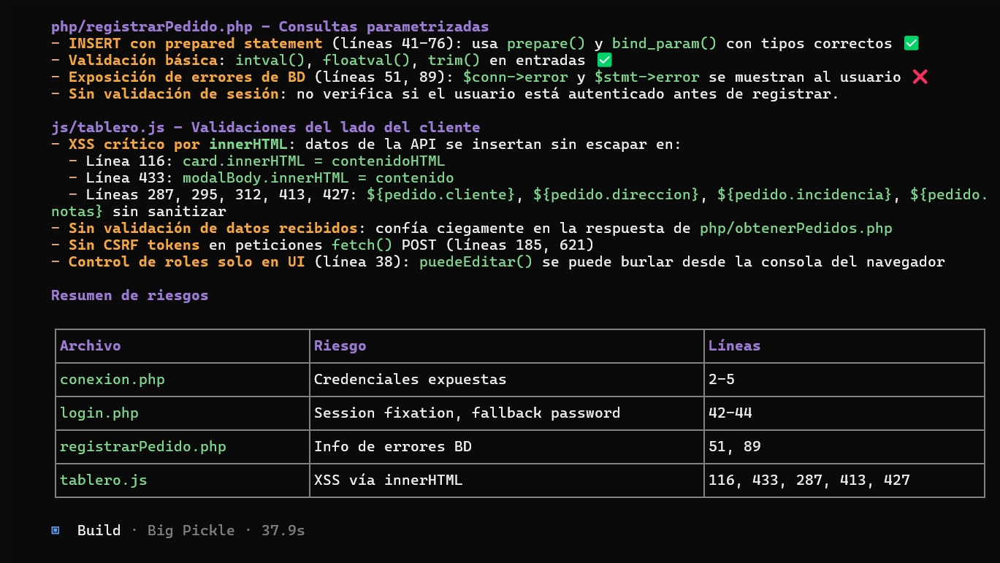

### CR-09: Revisión de js/tablero.js (XSS)
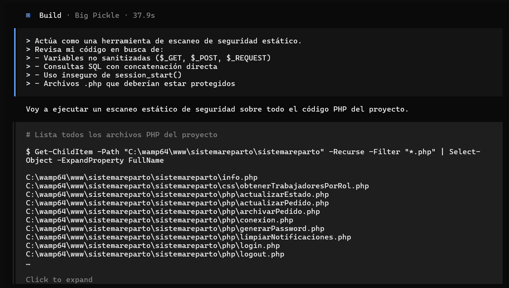

### CR-10: Escaneo de seguridad estático
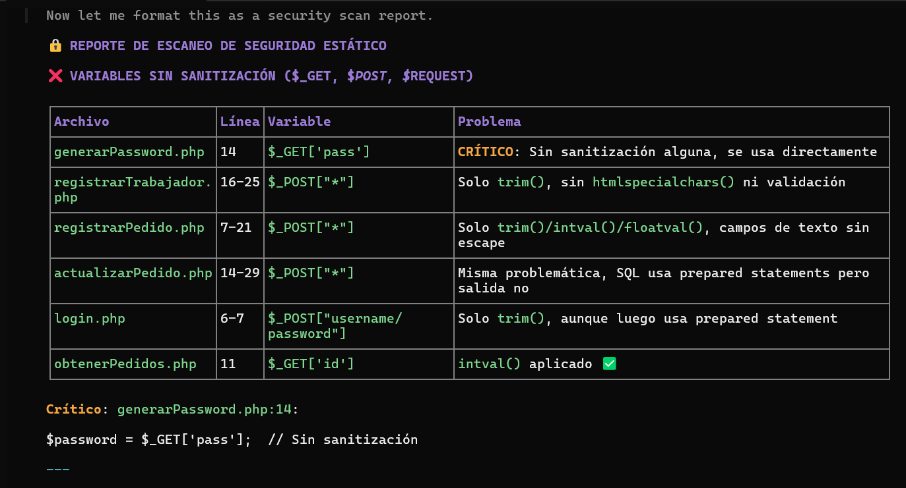

### CR-11: Resumen de riesgos por archivo
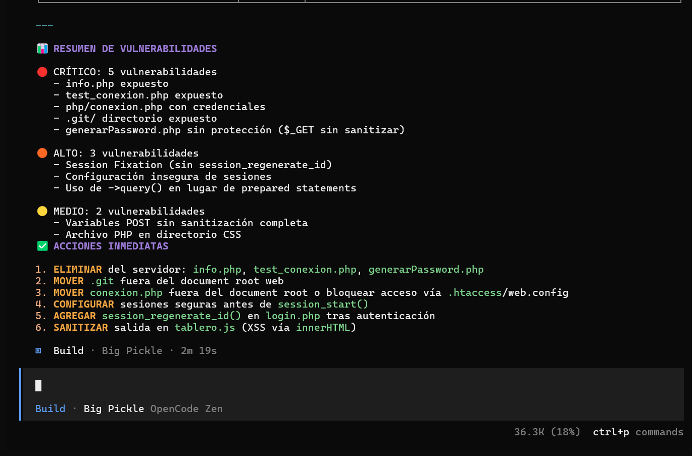

### CR-12: Cuentas por defecto
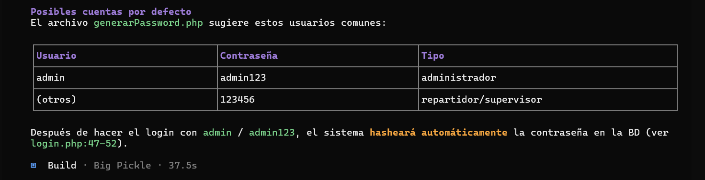

---

## Vulnerabilidades encontradas

| Archivo | Vulnerabilidad | Severidad | Líneas | Estado |
|---------|----------------|-----------|--------|--------|
| `php/conexion.php` | Credenciales hardcodeadas (root sin pass) | 🔴 CRÍTICO | 2-5 | Pendiente |
| `php/conexion.php` | Exposición de errores de BD al usuario | 🟡 MEDIO | 10 | Pendiente |
| `php/login.php` | Fallback de contraseña en texto plano | 🟠 ALTO | 42-44 | Pendiente |
| `php/login.php` | Session fixation (falta session_regenerate_id) | 🟠 ALTO | 57-61 | Pendiente |
| `php/registrarPedido.php` | Exposición de errores de BD | 🟡 MEDIO | 51, 89 | Pendiente |
| `php/generarPassword.php` | `$_GET['pass']` sin sanitizar | 🔴 CRÍTICO | 14 | Pendiente |
| `js/tablero.js` | XSS vía innerHTML sin sanitizar | 🔴 CRÍTICO | 116, 433, 287, 413, 427 | Pendiente |
| `info.php` | phpinfo() expuesto públicamente | 🔴 CRÍTICO | Todo | Pendiente |
| `test_conexion.php` | Herramienta de diagnóstico expuesta | 🔴 CRÍTICO | Todo | Pendiente |
| `.git/` | Directorio expuesto (descarga de código fuente) | 🔴 CRÍTICO | - | Pendiente |

---

## Malas prácticas identificadas

| Práctica | Ubicación | Severidad |
|----------|-----------|-----------|
| Código duplicado (`registrarTrabajador.php` y `obtenerTrabajadores.php` idénticos) | `php/` | 🟡 MEDIO |
| Archivo PHP en directorio CSS (`obtenerTrabajadoresPorRol.php`) | `css/` | 🟡 MEDIO |
| Uso de `->query()` en lugar de prepared statements | Múltiples archivos | 🟠 ALTO |
| Sin configuración segura de sesiones (`cookie_httponly`, `cookie_secure`, `use_strict_mode`) | Múltiples archivos | 🟠 ALTO |
| CORS `*` permisivo (Access-Control-Allow-Origin) | 8 archivos PHP | 🟡 MEDIO |

---

## Archivos sensibles expuestos

| Archivo | Riesgo | Acción recomendada |
|---------|--------|-------------------|
| `info.php` | 🔴 CRÍTICO - Expone configuración del servidor | Eliminar |
| `test_conexion.php` | 🔴 CRÍTICO - Herramienta de diagnóstico pública | Eliminar |
| `php/conexion.php` | 🔴 CRÍTICO - Credenciales de BD expuestas | Mover fuera del root web o bloquear acceso |
| `.git/` | 🔴 CRÍTICO - Permite descargar todo el código fuente | Mover fuera del root web |
| `generarPassword.php` | 🟠 ALTO - Genera hashes sin autenticación | Eliminar o proteger |

---

## Sugerencias de mejora (de OpenCode)

1. **Eliminar del servidor:** `info.php`, `test_conexion.php`, `generarPassword.php`
2. **Mover `.git` fuera del document root** web
3. **Mover `php/conexion.php`** fuera del root web o bloquear acceso vía `.htaccess`
4. **Usar variables de entorno** para credenciales de BD
5. **Convertir todas las consultas `->query()` a prepared statements**
6. **Unificar archivos duplicados** y eliminar `css/obtenerTrabajadoresPorRol.php`
7. **Restringir CORS a dominios específicos** en lugar de `*`
8. **Configurar sesiones seguras**:
   ```php
   ini_set('session.cookie_httponly', 1);
   ini_set('session.cookie_secure', 1);
   ini_set('session.use_strict_mode', 1);