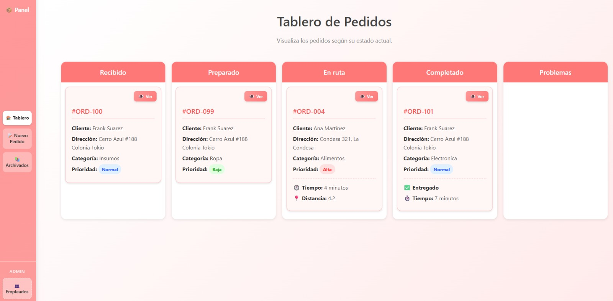
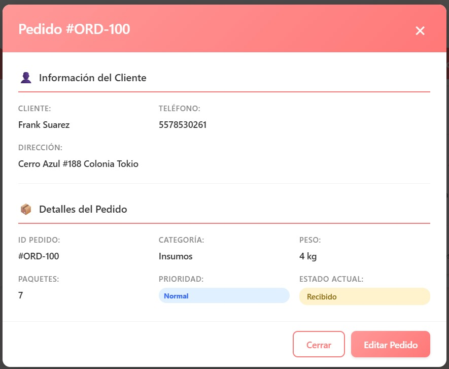
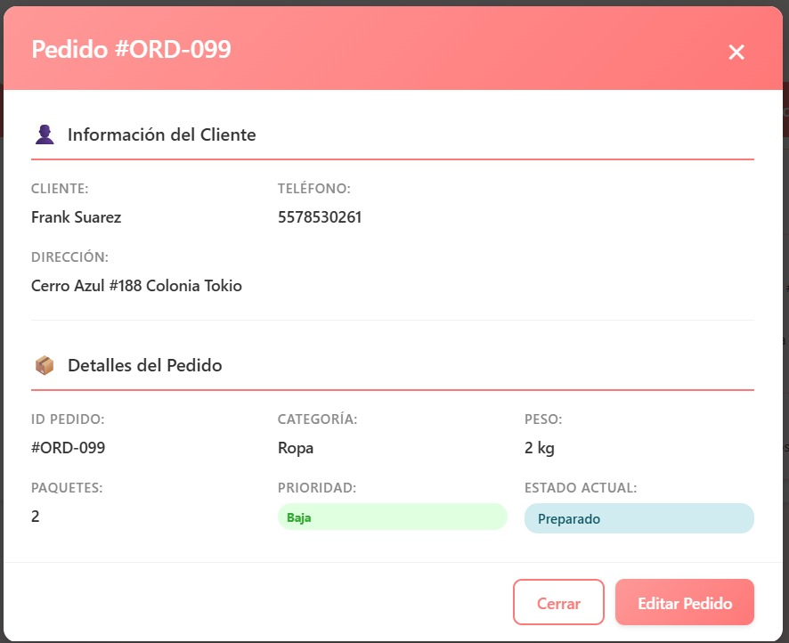
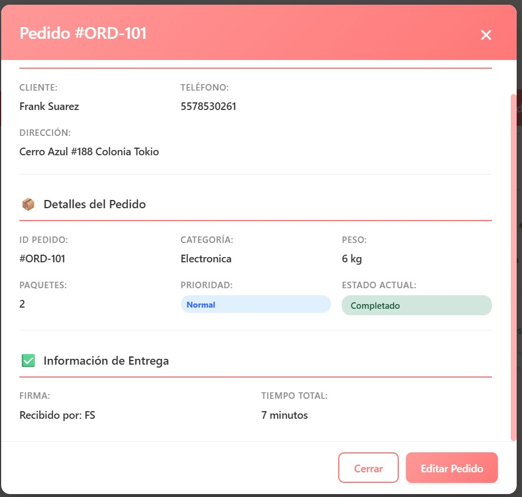
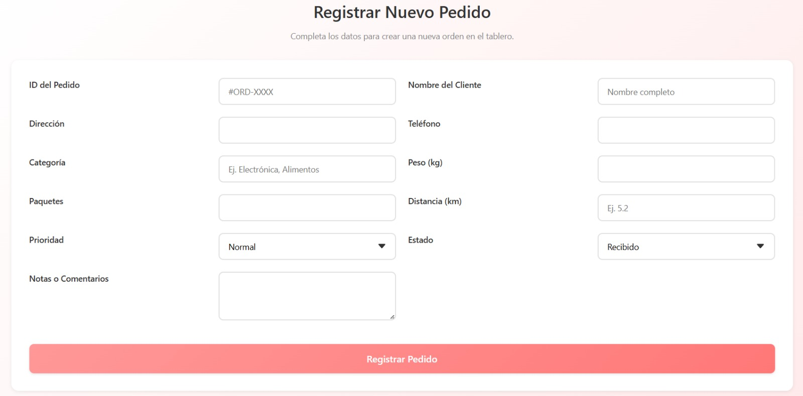
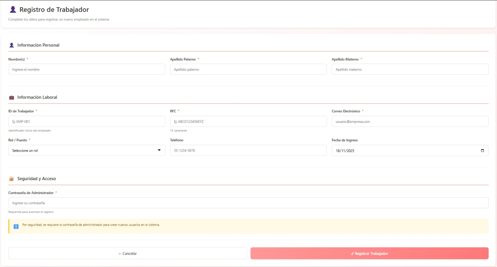

# Reporte de Pruebas - Sistema de Reparto Kanban

**Fecha:** 5 Mayo 2026  
**Responsable:** Víctor Manuel González Ruiz  
**Proyecto:** Plataforma de Gestión de Proyectos Estilo Kanban

---

## Resumen de pruebas

| ID | Funcionalidad | Resultado | Evidencia |
|----|---------------|-----------|-----------|
| P-01 | Tablero Kanban | ✅ Exitosa | `tablero.jpg` |
| P-02 | Información del pedido | ✅ Exitosa | `información_pedido.jpg` |
| P-03 | Info pedido detallada | ✅ Exitosa | `info_pedido.jpg` |
| P-04 | Asignar repartidor | ✅ Exitosa | `asinar_repartidor.jpg` |
| P-05 | Información de entrega | ✅ Exitosa | `info_entrega.jpg` |
| P-06 | Crear nuevo pedido | ✅ Exitosa | `crear_pedido.jpg` |
| P-07 | Registro de usuario | ✅ Exitosa | `registro_usuario.jpg` |

---

## Evidencias

### Tablero Kanban

### Información del pedido

### Info pedido detallada

### Asignar repartidor

### Información de entrega

### Crear nuevo pedido

### Registro de usuario

---

## Observaciones

- El tablero Kanban muestra correctamente las columnas y tarjetas
- La información del pedido se visualiza adecuadamente
- La asignación de repartidores funciona correctamente
- El registro de usuarios permite crear nuevas cuentas
- La creación de pedidos se realiza sin errores

---

## Conclusión

El sistema de reparto Kanban ha sido probado exitosamente. Todas las funcionalidades principales operan según lo esperado, cumpliendo con los requisitos establecidos para el proyecto.